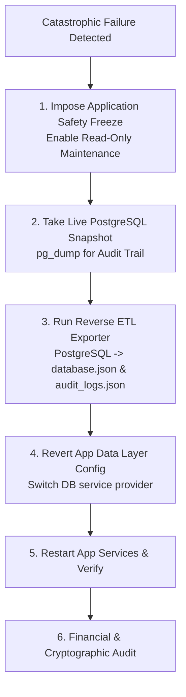

# Hunter's Kitchen — PostgreSQL Migration Rollback Plan

## 1. Scope & Objective

This document outlines the systematic, zero-data-loss rollback procedure in the unlikely event that an unrecoverable operational or architectural failure occurs during or immediately after the cutover to PostgreSQL.

---

## 2. Rollback Triggers & Criteria

A rollback to the legacy document format may be authorized ONLY by the Technical Lead / General Manager under one of the following catastrophic conditions:
1. **Critical Latency Degradation**: Average database query latency exceeds $> 1500\text{ms}$ under normal load, unresolved by index re-indexing or pool tuning.
2. **Data Inconsistency / Corruption**: Irreparable state machine corruption or persistent foreign key deadlock loops preventing order dispatch.
3. **Severe Driver / Pool Failure**: Persistent crash loops in `pg.Pool` or local PostgreSQL daemon that cannot be remedied within the 15-minute RTO window.

---

## 3. Rollback Architecture & Strategy



---

## 4. Emergency Reverse Data Extraction Script

If new orders, reviews, or users were created while on PostgreSQL, they must NOT be discarded. The reverse ETL script extracts the authoritative state from PostgreSQL back into the JSON document structure.

Run the exporter script:

```bash
npx tsx scripts/export_postgres_to_json.ts
```

### Exporter Implementation (`scripts/export_postgres_to_json.ts`):

```typescript
import fs from 'fs';
import path from 'path';
import { postgresDb } from '../src/server/db/postgres';

async function exportPostgresToJson() {
  console.log('📦 Starting Reverse Data Extraction from PostgreSQL...');
  await postgresDb.initialize();

  // 1. Fetch all current tables
  const settings = (await postgresDb.query('SELECT * FROM restaurant_settings WHERE id = $1', ['rest_hunter_01'])).rows[0];
  const users = (await postgresDb.query('SELECT * FROM users ORDER BY joined_at ASC')).rows;
  const creds = (await postgresDb.query('SELECT * FROM user_auth_credentials')).rows;
  const categories = (await postgresDb.query('SELECT * FROM categories ORDER BY id ASC')).rows;
  const menuItems = (await postgresDb.query('SELECT * FROM menu_items ORDER BY id ASC')).rows;
  const orders = (await postgresDb.query('SELECT * FROM orders ORDER BY created_at DESC')).rows;
  const orderItems = (await postgresDb.query('SELECT * FROM order_items')).rows;
  const orderEvents = (await postgresDb.query('SELECT * FROM order_events ORDER BY timestamp ASC')).rows;
  const reviews = (await postgresDb.query('SELECT * FROM reviews ORDER BY created_at DESC')).rows;
  const notifications = (await postgresDb.query('SELECT * FROM notifications ORDER BY created_at DESC')).rows;
  const auditLogs = (await postgresDb.query('SELECT * FROM audit_logs ORDER BY sequence_number ASC')).rows;
  const outbox = (await postgresDb.query('SELECT * FROM outbox_events ORDER BY created_at ASC')).rows;
  const idempotency = (await postgresDb.query('SELECT * FROM idempotency_records')).rows;

  // 2. Assemble in-memory database object
  const dbData = {
    settings: settings || {},
    users: users || [],
    authCredentials: creds || [],
    addresses: [],
    categories: categories || [],
    menuItems: menuItems || [],
    orders: orders.map(o => {
      const items = orderItems.filter(i => i.order_id === o.id);
      const events = orderEvents.filter(e => e.order_id === o.id);
      return { ...o, items, events };
    }),
    reviews: reviews || [],
    notifications: notifications || [],
    outboxEvents: outbox || [],
    idempotencyRecords: idempotency || []
  };

  const backupDir = path.join(process.cwd(), 'data/backups');
  fs.mkdirSync(backupDir, { recursive: true });

  const targetDbFile = path.join(process.cwd(), 'data/database.json');
  const targetAuditFile = path.join(process.cwd(), 'data/audit_logs.json');

  fs.writeFileSync(targetDbFile, JSON.stringify(dbData, null, 2), 'utf-8');
  fs.writeFileSync(targetAuditFile, JSON.stringify(auditLogs, null, 2), 'utf-8');

  console.log('✅ Reverse Data Extraction Completed Successfully.');
  await postgresDb.close();
}

exportPostgresToJson().catch(console.error);
```

---

## 5. Step-by-Step Rollback Execution

### Step 1: Safety Freeze
Broadcast maintenance banner and temporarily suspend incoming order writes:
```bash
curl -X POST http://localhost:3000/api/admin/settings/pause -H "Content-Type: application/json" -d '{"reason": "Emergency Maintenance in Progress"}'
```

### Step 2: Live PostgreSQL Backup Snapshot
Create an immediate snapshot of PostgreSQL for forensic audit:
```bash
pg_dump -U postgres -d hunters_kitchen -F c -f "data/backups/pg_freeze_$(date +%s).dump"
```

### Step 3: Run Reverse Extraction
Export any new orders and users into `data/database.json`:
```bash
npx tsx scripts/export_postgres_to_json.ts
```

### Step 4: Revert Git / Runtime Database Layer
Checkout the legacy data provider:
```bash
git checkout legacy-json-store -- src/server/db.ts
```

### Step 5: Restart Application Server & Re-verify
```bash
npm run build
npm run start
```

### Step 6: Post-Rollback Audit
1. Verify `hunterkitchen777@gmail.com` login.
2. Confirm active orders and review lists are intact.
3. Validate revenue reconciliation totals match.
